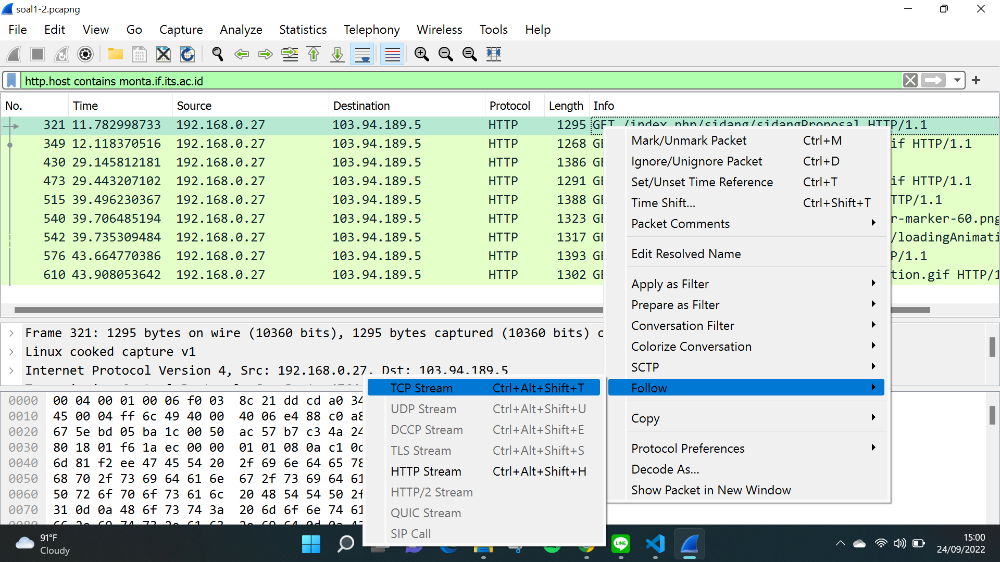
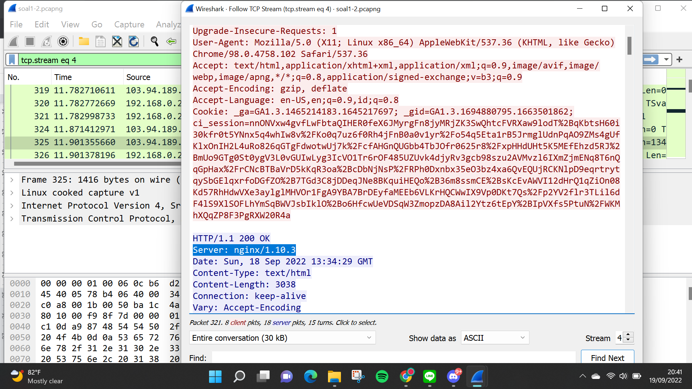
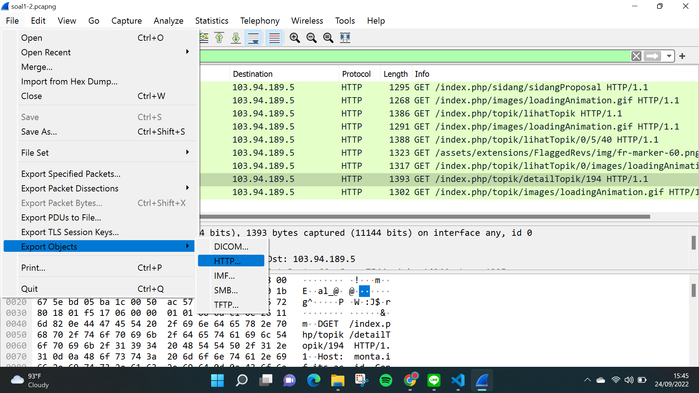
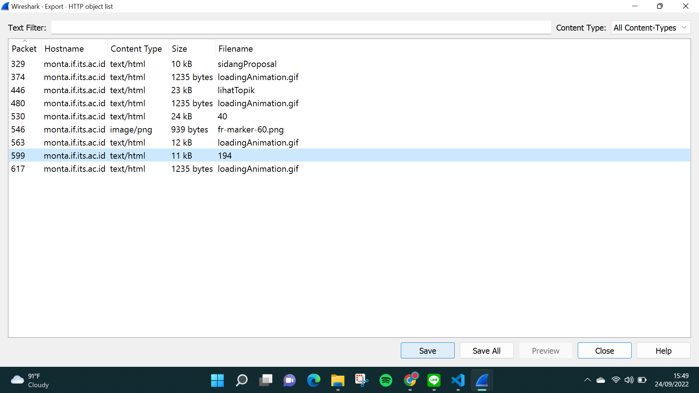
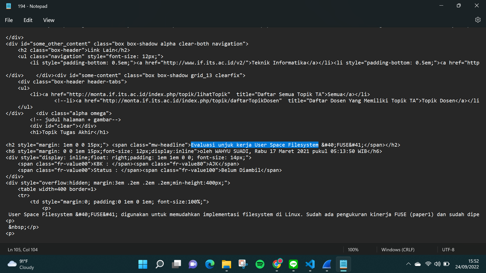

# Komunikasi Data dan Jaringan Komputer
# Laporan Praktikum Modul 1 ITA07

# Anggota

| Nama                           | NRP          | 
| -------------------------------| -------------| 
| Naftali Salsabila Kanaya Putri    | `5027201012` | 
| Ariel Daffansyah Aliski           | `5027201058` | 
| Anak Agung Bintang Krisnadewi     | `5027201060` |

## Soal 1

### Menyebutkan web server yang digunakan pada "monta.if.its.ac.id"
 
- `http.host contains monta.if.its.ac.id`
     
    display filter menggunakan domain di atas, lalu follow, pilih TCP Stream seperti yang ada di bawah ini.
    
    
    setelah itu akan ditemukan web server yang digunakan pada **monta.if.its.ac.id** adalah **nginx/1.10.3**
    

## Soal 2

### Menemukan detail topik pada website “monta.if.its.ac.id” yang berisi judul TA
 
- `http.host contains monta.if.its.ac.id`
     
    mirip dengan cara nomor 1, display filter menggunakan domain di atas, lalu klik **File**, pilih **Export Objects**, pilih **HTTP** seperti yang ada di bawah ini.
    

    setelah itu export file dengan nama **194** yang merupakan detail topik TA, lalu klik Save. 
    

    setelah itu, buka file yang telah di export, dan akan ditemukan judul TA yaitu **Evaluasi unjuk kerja User Space Filesystem**
    
