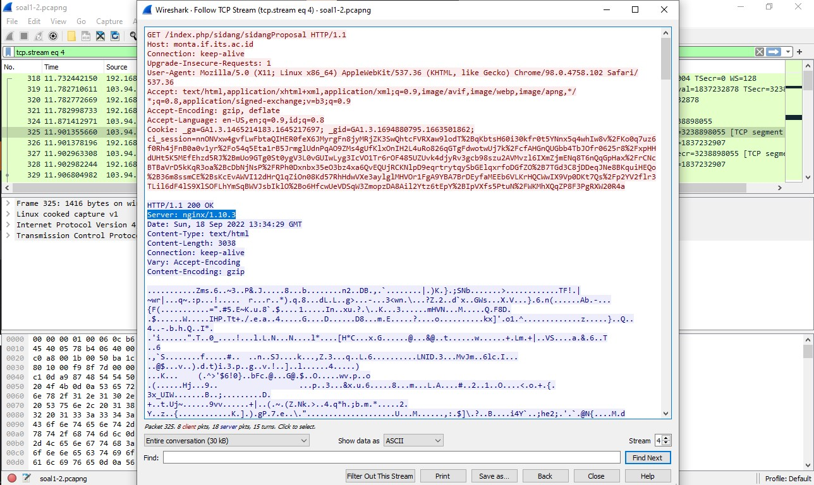
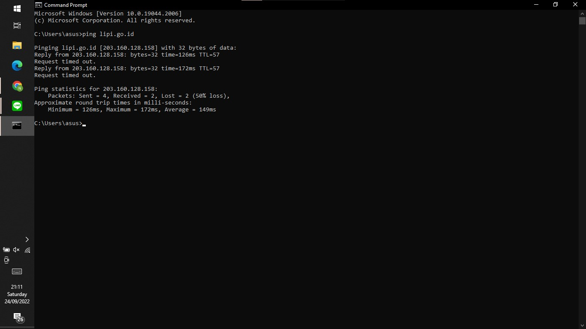

# Komunikasi Data dan Jaringan Komputer
# Laporan Praktikum Modul 1 ITA07

# Anggota

| Nama                           | NRP          | 
| -------------------------------| -------------| 
| Naftali Salsabila Kanaya Putri    | `5027201012` | 
| Ariel Daffansyah Aliski           | `5027201058` | 
| Anak Agung Bintang Krisnadewi     | `5027201060` |

## Soal 1

### Menyebutkan web server yang digunakan pada "monta.if.its.ac.id"
 
    display filter menggunakan domain http.host contains monta.if.its.ac.id lalu follow, pilih TCP Stream seperti yang ada di bawah ini.
    
    setelah itu akan ditemukan web server yang digunakan pada monta.if.its.ac.id adalah nginx/1.10.3
    

## Soal 2

### Menemukan detail topik pada website “monta.if.its.ac.id” yang berisi judul TA
 
    mirip dengan cara nomor 1, display filter menggunakan domain http.host contains monta.if.its.ac.id, lalu klik File, pilih Export Objects, pilih HTTP seperti yang ada di bawah ini.
    
    setelah itu export file dengan nama 194 yang merupakan detail topik TA, lalu klik Save. 
    
    setelah itu, buka file yang telah di export, dan akan ditemukan judul TA yaitu Evaluasi unjuk kerja User Space Filesystem
    
    
## Soal 3
Untuk memfilter sesuai permintaan soal digunakan perintah display filter tcp.dstport == 80 || udp.dstport == 80

## Soal 4
Untuk memfilter sesuai permintaan soal didgunakan perintah display filter tcp.srcport == 21 || udp.srcport == 21

## Soal 5
Untuk memfilter sesuai permintaan soal digunakan display filter  tcp.srcport == 443 || udp.srcport == 443 

## Soal  6
Periksa terlebih dahulu apa IP Address website lipi.go.id menggunakan Command Prompt dengan command
`ping lipi.go.id`

Setelah ditemukan gunakan display filter sesuai ip addressnya sebagai berikut: `ip.dst == 203.160.128.158`

## Soal 7
Periksa IP Adress sendiri terlebih dahulu menggunakan Command Prompt dengan command `ipconfig` dan ambil IP dari connection yang digunakan (saya menggunakan WIFI)

Lalu ambil capture dari connection yang digunakan oleh diri sendiri, dimana saya di sini menggunakan WIFI

lalu gunakan display filter sesuai ip address kita sebagai berikut: `ip.src == 192.168.1.110`

## Soal 8
Karena kecurangan berbentuk percakapan 2 arah (2 host). Maka protocol yang digunakan yaitu `TCP` dengan flag yang digunakan yaitu `ACK`, dan bukan `SYN` karena flag tersebut untuk percakapan 1 arah.  
Maka Display filter yang digunakan untuk flagsnya yaitu `tcp.flags.syn==0 && tcp.flags.ack==1.`

Kemudian pilih salah satu paket yang terfilter dan lakukan `follow - TCP Stream` dan akan terlihat percakapannya

